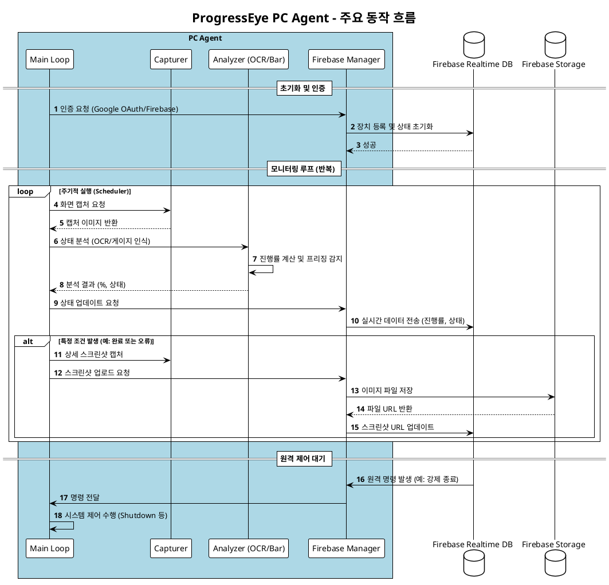

# PC Agent - 기술 설계서

---

## 1. 기술 스택

| 영역 | 선택 | 근거 |
|------|------|------|
| 언어 | Python 3.11+ | 이미지 처리 생태계 풍부, 빠른 프로토타이핑 |
| GUI 프레임워크 | PyQt6 | 영역 선택 오버레이, 설정 창 구현 |
| 화면 캡처 | mss | PIL 대비 3~5배 빠른 부분 캡처, thread-local GDI |
| 바 탐지 | opencv-python-headless | OpenCV 4전략 기반 진행바 자동 탐지 |
| OCR 감지 | RapidOCR (ONNX Runtime) | 숫자가 보이는 진행바에서 % 수치 직접 인식. 초기화 실패 시 PaddleOCR 호환 모드 자동 전환 |
| 인증 | google-auth + google-auth-oauthlib | 브라우저 기반 Google OAuth 2.0 |
| Firebase | requests (Firebase REST API) | Realtime DB 읽기/쓰기 (`?auth={idToken}` 쿼리 파라미터), firebase-admin은 서버용이므로 데스크톱 클라이언트에서는 REST API 직접 호출 |
| 하드웨어 샘플러 | Windows PDH (% Processor Utility) + GetSystemTimes + psutil + nvidia-ml-py | CPU(주파수 보정)/GPU/RAM 수집, 이동평균 산출 |
| 패키징 | Nuitka (standalone, C 네이티브 컴파일) + MSIX | 단일 .exe 생성, Microsoft Store 배포 |
| 설정 저장 | JSON (AppData) | 영역 좌표, 색상, 사용자 설정 영속화 |
| 토큰 저장 | keyring | OS 자격증명 저장소에 안전하게 토큰 보관 |
| SSE 스트리밍 | sseclient-py | RTDB 명령 실시간 수신 (commands/ 경로) |
| 강제 버전 체크 | Firestore REST API (requests) | appConfig/pc 문서에서 minVersion 조회 |

> **이중 감지 모드**: 진행바 픽셀 분석(OpenCV)과 OCR 숫자 감지(RapidOCR) 두 가지 모드를 지원한다. 숫자가 화면에 표시되는 경우 OCR 모드를, 그렇지 않은 경우 바 탐지 모드를 사용한다.

---

## 2. 모듈 구조

```
pc-agent/
├── main.py                  # 엔트리포인트, 앱 초기화 + 인증 통합 + Firebase 연동
├── config.py                # 설정 관리 (JSON)
├── auth/
│   ├── google_oauth.py      # InstalledAppFlow.run_local_server(port=8080)으로 브라우저 팝업 → id_token 획득
│   ├── firebase_auth.py     # Firebase REST API (signInWithIdp + refresh_token)로 Firebase 로그인
│   └── token_manager.py     # keyring으로 Windows 자격증명 저장소에 토큰 보관, 자동 갱신
├── firebase/
│   ├── realtime_db.py       # RealtimeDB 클래스, REST API 래퍼 (get/put/patch/delete)
│   ├── device_manager.py    # DeviceManager 클래스, 기기 등록/상태/하트비트/오프라인
│   ├── command_listener.py  # SSE 기반 명령 수신 (screenshot, monitor, forceLogout)
│   └── storage.py           # Firebase Storage 스크린샷 업로드
├── core/
│   ├── bar_finder.py        # OpenCV 4전략 바 탐지 + Sobel 트랙 확장
│   ├── bar_analyzer.py      # 전환점 분석 (그라데이션 지원)
│   ├── ocr_reader.py        # RapidOCR(ONNX Runtime) 기반 숫자% 탐지. 1차: 원본+업스케일, 2차(lazy fallback): 적응형 이진화
│   ├── capturer.py          # mss 기반 화면 캡처 (thread-local GDI)
│   ├── freeze_detector.py   # 진행 멈춤 감지
│   ├── scheduler.py         # Timer 기반 주기 캡처
│   └── system_monitor.py    # CPU/GPU/RAM 샘플러 (Windows PDH, 앱 시작 5초 후 자동 시작)
├── ui/
│   ├── main_window.py       # 메인 창 (다크 테마, 색상 팔레트 상수)
│   ├── area_selector.py     # 드래그 영역 선택 오버레이 (신규 영역)
│   ├── region_editor.py     # 기존 영역 편집 오버레이 (8핸들 리사이즈, 바 탐지 미리보기)
│   ├── color_picker.py      # InteractiveBarPreview + BarPreviewDialog
│   ├── ocr_preview.py       # OCR 탐지 미리보기 (빨간+시안 사각형)
│   └── region_viewer.py     # 전체 화면 탐지 결과 오버레이
├── utils/
│   ├── i18n.py              # 한/영 번역 모듈
│   ├── error_reporter.py    # sys.excepthook → Firestore errorReports/{version}/reports/ 기록
│   └── logger.py
└── resources/
    └── icon.ico
```

---

## 3. 주요 시퀀스 다이어그램

PC 에이전트의 핵심 동작 흐름(캡처 → 분석 → Firebase 동기화)을 나타내는 다이어그램입니다.



---

## 4. 핵심 플로우

### 3.1 앱 시작 → 인증 플로우

```
앱 시작
  │
  ├─ Firestore appConfig/pc 에서 minVersion 조회 (REST API, 인증 불필요)
  │     ├─ APP_VERSION >= minVersion ──→ 계속
  │     └─ APP_VERSION < minVersion ──→ 업데이트 필요 다이얼로그 → 앱 종료
  │
  ├─ keyring에 저장된 토큰 있음 ──→ refresh_token으로 Firebase 자동 로그인 (_try_auto_login)
  │                          │
  │                          ├─ 성공 ──→ Firebase 초기화 (기기 등록 + 프로필 저장 + 60초 하트비트 / 30초 stats 동기화)
  │                          └─ 실패 ──→ 수동 로그인 다이얼로그 (_ensure_login)
  │
  └─ 토큰 없음 ──→ 수동 로그인 다이얼로그 (Retry/Cancel)
                 │
                 └─ Google OAuth (InstalledAppFlow.run_local_server(port=8080))
                       │
                       └─ id_token → signInWithIdp REST API → Firebase uid 획득
                             │
                             └─ keyring 저장 → Firebase 초기화 → 메인 화면
```
### 3.2 게이지 및 숫자 분석 상세 (ImageCacheMixin)

에이전트의 CPU 효율을 위해 동일한 이미지 프레임에 대한 중복 연산을 방지하는 캐싱 레이어가 도입되었습니다.

*   **ImageCacheMixin:** 모든 이미지 분석 클래스(`BarAnalyzer`, `OcrReader`)의 베이스 클래스로, 이미지의 원본 해시(MD5)를 비교하여 변화가 없을 경우 캐시된 결과를 즉시 반환합니다.
*   **상세 로직 다이어그램:**
    *   [게이지 바 분석 로직 (BarAnalyzer)](./diagrams/gauge-bar-analysis.puml)
    *   [게이지 숫자 인식 로직 (OcrReader)](./diagrams/gauge-number-ocr.puml)

### 3.3 영역 선택 → 모드 분기 → 탐지 → 등록 플로우

```
메인 화면
  │
  ├─ [프로그래스바 영역 추가] ──→ 드래그 영역 선택
  │                                  │
  │                                  ▼
  │                            OpenCV bar_finder (4전략) → 바 영역 자동 탐지
  │                                  │
  │                                  ▼
  │                            InteractiveBarPreview (파워포인트식 리사이즈 핸들)
  │                            사용자가 바 영역을 편집 → bar offset 저장
  │                                  │
  │                                  ▼
  │                            [확인] → full area 좌표 + bar offset + template 이미지 저장
  │                                     "진행률 바" 배지로 등록
  │
  └─ [숫자 영역 추가] ──→ (OCR 모드, 변경 없음)
                             │
                             ▼
                       OCR 탐지 미리보기
                       (빨간+시안 사각형으로 감지 결과 표시)
                             │
                             ▼
                       [확인] → "진행률 퍼센트" 배지로 등록
```

### 3.2b 모니터링 파이프라인

```
모니터링 사이클 (매 N초) — 영역별 병렬 실행 (ThreadPoolExecutor, max_workers=os.cpu_count())
  │
  ├─ [스킵 가드] 해당 영역 분석 중이면 즉시 스킵 (중복 실행 방지)
  │
  ├─ full area 스크린샷 캡처
  │
  ├─ template 이미지와 비교 (64×64 grayscale + Pearson 상관계수)
  │     ├─ 일치 → 계속
  │     └─ 불일치 → 화면 변경 감지 → 해당 영역 작업 상태 "stopped" 전환
  │                                   └─ 모든 영역이 stopped/completed → 모니터링 자동 종료
  │
  ├─ bar offset으로 full area에서 바 영역만 crop
  │
  └─ bar_analyzer만으로 fill 비율 계산 (bar_finder 미사용)
       └─ 진행률 산출 → Firebase 전송
            └─ 완료 조건 충족 → 작업 상태 "completed" 전환
                               └─ 모든 영역이 stopped/completed → 모니터링 자동 종료
```

> **핵심**: bar_finder는 영역 선택/재선택 시에만 실행. 모니터링 중에는 bar_analyzer만 사용.
>
> **작업 상태(task status)**: 모니터링 중 카드에 실시간 상태 표시.
> - `running` (진행 중) → Firebase `"r"`, 카드에 녹색 "● 진행 중"
> - `completed` (완료) → Firebase `"c"`, 카드에 "✓ 작업 완료"
> - `stopped` (화면 변경으로 중지) → Firebase `"s"`, 카드에 "⚠ 작업 중지"
> - `frozen` (멈춤) → Firebase `"f"`, 카드에 경고 표시
> - `idle` (모니터링 전) → Firebase `"i"`

### 3.3 바 탐지 파이프라인 (OpenCV 4전략)

```python
# 의사코드
class BarFinder:
    def find(self, image):
        """
        OpenCV 4전략으로 진행바 후보 영역을 탐지한다.
        
        전략 1: Canny + Otsu 엣지 기반 탐지
        전략 2: 적응형 이진화 (Adaptive Threshold)
        전략 3: HSV 채도 분할 (색상 있는 바 탐지)
        전략 4: 배경 제거 (배경색과 다른 영역 추출)
        
        각 전략의 결과를 앙상블하여 최종 바 영역 반환.
        Sobel 트랙 확장으로 바 경계를 정밀하게 보정.
        """
        candidates = []
        candidates += self._canny_otsu(image)
        candidates += self._adaptive_threshold(image)
        candidates += self._hsv_saturation(image)
        candidates += self._background_removal(image)
        
        return self._ensemble(candidates)
```

### 3.4 바 분석 엔진 (전환점 분석)

```python
# 의사코드
class BarAnalyzer:
    def analyze(self, image):
        """
        진행바 이미지에서 채움 비율을 계산한다.
        
        원리:
        1. 슬라이딩 윈도우로 열(column)별 색상 변화를 추적
        2. 채움 영역에서 빈 영역으로 전환되는 지점(전환점) 탐지
        3. 그라데이션 진행바도 지원 (색상 연속 변화 허용)
        4. 전환점 위치 / 전체 너비 = 진행률(%)
        """
        pixels = cv2.cvtColor(image, cv2.COLOR_BGR2RGB)
        transition_point = self._find_transition(pixels)
        progress = (transition_point / image.shape[1]) * 100
        return round(progress, 1)
```

### 3.5 OCR 탐지 파이프라인 (RapidOCR)

```python
# 의사코드
class OcrReader:
    def find_percentages(self, image):
        """
        RapidOCR(ONNX Runtime)으로 진행률 숫자를 인식한다.

        변형 순서 (lazy fallback):
        1. 원본 이미지 (+ 작은 이미지면 2x 업스케일 병행)
        2. 1차에서 결과 없을 때만: 적응형 이진화(adaptiveThreshold) 변형

        인식 패턴:
        - "45%" 형태: % 기호와 함께 인식
        - 단독 숫자 "45": 0~100 범위의 숫자만 있어도 감지
        - 앞뒤 문자 포함 텍스트에서도 추출 (regex search)

        디버그 모드(-d 실행 시): OCR 크롭 이미지를 로컬에 저장.
        """
        results = []
        for variant in primary_variants:            # 원본 [+ 업스케일]
            results += _process_variant(variant)
        if not results:
            results += _process_variant(threshold_variant)   # lazy fallback
        return results
```

### 3.6 영역 선택/편집 플로우

```
[신규 영역 추가]
1. 사용자가 "프로그래스바 영역 추가" 또는 "숫자 영역 추가" 클릭
2. AreaSelector: 전체 화면 반투명 오버레이 (멀티모니터, mss↔Qt 좌표 변환)
3. 마우스 드래그로 사각형 영역 지정
4. 모드에 따라 미리보기:
   - 바 탐지 모드: BarPreviewDialog + InteractiveBarPreview (8핸들 바 영역 편집)
   - OCR 모드: OcrPreviewDialog (빨간+시안 사각형으로 감지 위치 표시)
5. [확인] → 좌표 + 모드 저장
   [재선택] → 2로 복귀

[기존 바 영역 재선택 (Reselect)]
1. BarPreviewDialog에서 [재선택] 클릭
2. RegionEditor: 전체 화면 오버레이, 기존 선택 영역을 8핸들로 편집
   - 드래그 후 300ms 후 자동 바 탐지 실행 → 빨간 사각형으로 탐지 위치 표시
   - 오버레이 표시 즉시에도 초기 바 탐지 실행
3. [Enter] 확인 → 새 좌표로 업데이트 + BarPreviewDialog 재열기
   [Esc] 취소
```

---

## 4. 설정 파일 구조

```json
// %APPDATA%/ProgressEye/config.json
{
  "version": 2,
  "auth": {
    "uid": "firebase_uid_xxx",
    "email": "user@gmail.com",
    "device_id": "pc_a1b2c3d4",
    "device_name": "작업용 PC"
  },
  "capture": {
    "interval_seconds": 30,
    "regions": [
      {
        "id": "task_001",
        "label": "프리미어 렌더링",
        "type": "bar",
        "monitor": 0,
        "x": 520, "y": 980,
        "width": 300, "height": 20,
        "abs_x": 520, "abs_y": 980,
        "direction": "horizontal",
        "bar_mode": "auto",
        "bar_left": 5, "bar_top": 2, "bar_right": 295, "bar_bottom": 18,
        "alert_threshold": 90,
        "alert_delay_minutes": 0
      },
      {
        "id": "task_002",
        "label": "Blender 렌더링",
        "type": "ocr",
        "monitor": 0,
        "x": 800, "y": 600,
        "width": 80, "height": 24,
        "alert_threshold": 90
      }
    ]
  },
  "freeze_detection": {
    "enabled": true,
    "timeout_minutes": 5
  },
  "remote_command": {
    "require_confirmation": true
  },
  "startup": {
    "auto_start": false,
    "start_minimized": true
  }
}
```

> **Note**: Google OAuth 토큰은 `config.json`에 저장하지 않고, `keyring` 라이브러리를 통해 **Windows 자격 증명 관리자**에 안전하게 보관한다.

---

## 5. 빌드 및 배포

### 빌드 명령

```powershell
# EXE 빌드 (Nuitka)
powershell -ExecutionPolicy Bypass -File .\packaging\scripts\build_exe.ps1 -Clean

# MSIX 패키지 빌드 (Microsoft Store용)
powershell -ExecutionPolicy Bypass -File .\packaging\msix\build_store_msix.ps1 -BuildExe -CleanExe -SkipSign
```

### Nuitka 포함 항목

- Python 런타임 (C 네이티브 컴파일)
- PyQt6 라이브러리 (플러그인 자동 번들링)
- opencv-python-headless (바 탐지/분석)
- rapidocr-onnxruntime (OCR 엔진)
- Google Auth + requests (google-auth, google-auth-oauthlib, requests, keyring)
- sseclient-py (SSE 명령 수신)
- psutil, nvidia-ml-py (하드웨어 모니터링)
- 앱 아이콘 및 리소스
- templates/ 폴더 (영역 등록 시점 스크린샷)

---

## 6. 에러 처리 전략

| 상황 | 처리 |
|------|------|
| Google 로그인 실패 | 에러 메시지 표시, 재시도 안내 |
| 토큰 갱신 실패 | 자동 재로그인 시도, 실패 시 로그인 화면 표시 |
| 바 탐지 실패 | 4전략 모두 실패 시 수동 색상 지정 안내 |
| OCR 인식 실패 | RapidOCR 초기화 실패 시 PaddleOCR 호환 모드 자동 전환, 이전 값 유지 |
| 분석 신뢰도 낮음 | 이전 값 유지, 3회 연속 시 "분석 오류" 상태 전송 |
| 네트워크 끊김 | 로컬 큐에 데이터 저장, 재연결 시 일괄 전송 |
| 캡처 영역 사라짐 | 대상 창 최소화/닫힘 감지 → "대기중" 상태 전환 |
| Firebase 연결 끊김 | 자동 재연결, 오프라인 큐잉 |
| 메모리 부족 | 캡처 이미지 즉시 해제, 히스토리 제한 |
| 버전 미달 | 업데이트 다이얼로그 표시 후 앱 종료 |
